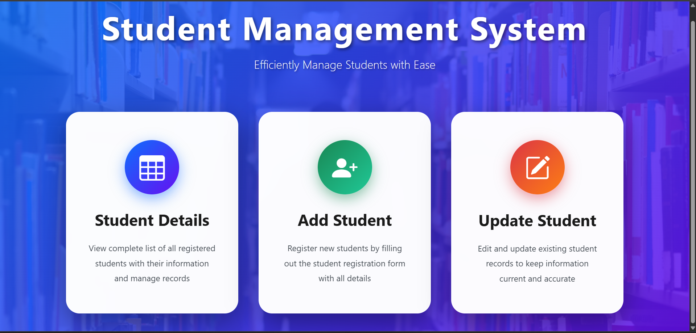
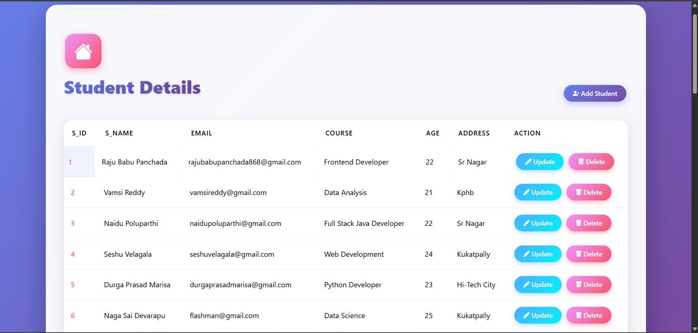
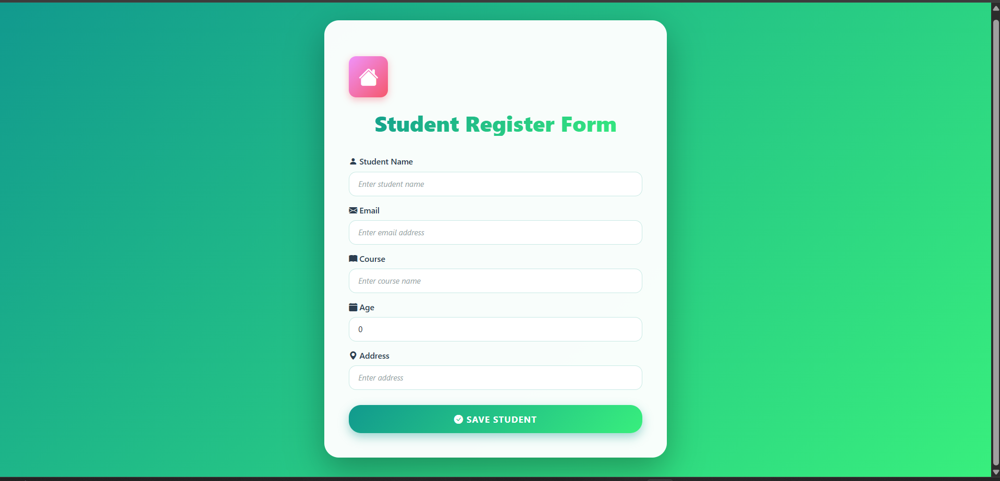
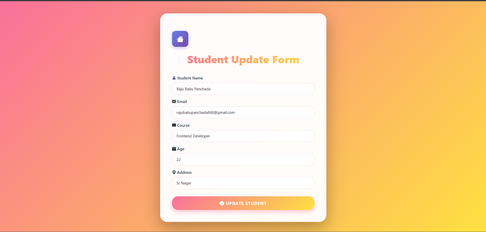

# Student Management System

## Project Description

The Student Management System is a comprehensive **CRUD** (Create, Read, Update, Delete) application designed to streamline student information management for educational institutions. Built with Spring Boot backend and enhanced with a visually stunning Thymeleaf frontend, this system provides an intuitive interface for administrators to manage student data effectively.

The application features a modern, gradient-based UI design with smooth animations and responsive layouts that work seamlessly across all devices. Each page has its own unique color scheme - from the blue-purple landing page to the teal-green add form and pink-yellow update form - creating an engaging user experience while maintaining professional functionality.

With built-in validation, easy navigation, and a clean data structure, this system serves as both a practical tool for student record management and a learning resource for developers interested in Spring Boot web application development. The project demonstrates best practices in MVC architecture, ORM integration with JPA/Hibernate, and modern frontend design principles.


A modern, full-stack web application built with Spring Boot and Thymeleaf for managing student records efficiently. Features a beautiful, responsive UI with gradient designs and smooth animations.


## Table of Contents

  - [Features](#features)
  - [Technologies Used](#technologies-used)
    - [Backend](#backend)
    - [Frontend](#frontend)
  - [Screenshots](#screenshots)
    - [Landing Page](#landing-page)
    - [Student Details Page](#student-details-page)
    - [Add Student Form](#add-student-form)
    - [Update Student Form](#update-student-form)
  - [Project Structure](#project-structure)
  - [Installation \& Setup](#installation--setup)
    - [Prerequisites](#prerequisites)
    - [Steps to Run](#steps-to-run)
  - [Database Schema](#database-schema)
    - [Student Entity](#student-entity)
  - [API Endpoints](#api-endpoints)
  - [Default Sample Data](#default-sample-data)
  - [UI Features](#ui-features)
  - [Dependencies](#dependencies)
  - [Future Enhancements](#future-enhancements)
  - [Contributing](#contributing)
  - [License](#license)
  - [Contact](#contact)
  - [Acknowledgments](#acknowledgments)


## Features

- **View Students**: Display all registered students in a comprehensive table
- **Add Students**: Register new students with complete details
- **Update Students**: Edit existing student information
- **Delete Students**: Remove student records
- **Responsive Design**: Works seamlessly across desktop, tablet, and mobile devices
- **Modern UI**: Beautiful gradient designs with smooth animations and transitions

## Technologies Used

### Backend
- **Spring Boot** - Application framework
- **Spring Data JPA** - Data persistence
- **Hibernate** - ORM implementation
- **H2/MySQL Database** - Data storage
- **Lombok** - Reduce boilerplate code

### Frontend
- **Thymeleaf** - Server-side template engine
- **Bootstrap 5.3.8** - CSS framework
- **Bootstrap Icons** - Icon library
- **Custom CSS** - Gradient designs and animations

## Screenshots

### Landing Page

*The main entry point with three action cards for navigation*

### Student Details Page

*View all students with their complete information in a table format*

### Add Student Form

*Register new students with name, email, course, age, and address*

### Update Student Form

*Edit existing student records with pre-filled information*

## Project Structure

```
student-management-system/
├── src/
│   ├── main/
│   │   ├── java/
│   │   │   └── com/sms/student_management_system/
│   │   │       ├── StudentManagementSystemApplication.java
│   │   │       ├── controller/
│   │   │       │   └── StudentController.java
│   │   │       ├── entity/
│   │   │       │   └── Student.java
│   │   │       └── repo/
│   │   │           └── StudentRepo.java
│   │   └── resources/
│   │       ├── templates/
│   │       │   ├── index.html
│   │       │   ├── home.html
│   │       │   ├── add_student.html
│   │       │   └── update_student.html
│   │       └── application.properties
│   └── test/
└── pom.xml
```

## Installation & Setup

### Prerequisites
- Java 17 or higher
- Maven 3.6+
- IDE (, Eclipse, or VS Code)

### Steps to Run

1. **Clone the repository**
   ```bash
   git clone https://github.com/yourusername/student-management-system.git
   cd student-management-system
   ```

2. **Configure Database** (Optional - H2 is configured by default)
   
   Edit `src/main/resources/application.properties`:
   ```properties
   # H2 Database (In-Memory)
   spring.datasource.url=jdbc:h2:mem:studentdb
   spring.datasource.driverClassName=org.h2.Driver
   spring.datasource.username=sa
   spring.datasource.password=
   spring.jpa.database-platform=org.hibernate.dialect.H2Dialect
   spring.h2.console.enabled=true
   
   # MySQL Database (Alternative)
   # spring.datasource.url=jdbc:mysql://localhost:3306/student_db
   # spring.datasource.username=root
   # spring.datasource.password=yourpassword
   # spring.jpa.hibernate.ddl-auto=update
   ```

3. **Build the project**
   ```bash
   mvn clean install
   ```

4. **Run the application**
   ```bash
   mvn spring-boot:run
   ```
   
   Or run directly from your IDE by executing `StudentManagementSystemApplication.java`

5. **Access the application**
   
   Open your browser and navigate to: `http://localhost:8080`

## Database Schema

### Student Entity

| Column  | Type    | Description              |
|---------|---------|--------------------------|
| id      | Integer | Primary Key (Auto)       |
| name    | String  | Student's full name      |
| email   | String  | Student's email address  |
| course  | String  | Enrolled course          |
| age     | Integer | Student's age            |
| address | String  | Student's address        |

## API Endpoints

| Method | Endpoint                      | Description                    |
|--------|-------------------------------|--------------------------------|
| GET    | `/`                           | Landing page                   |
| GET    | `/studentDetails`             | View all students              |
| GET    | `/saveStudentPage`            | Add student form               |
| POST   | `/saveStudent`                | Save new/updated student       |
| GET    | `/updateStudentPage/{id}`     | Update student form            |
| GET    | `/deleteStudent/{id}`         | Delete student by ID           |

## Default Sample Data

The application comes pre-loaded with 6 sample students for testing:

1. Raju Panchada - Java Full Stack
2. Vamsi Reddy - Data Analysis
3. Naidu Poluparthi - Full Stack Java Developer
4. Seshu Velagala - Web Development
5. Durga Prasad Marisa - Python Developer
6. Naga Sai Devarapu - Data Science

## UI Features

- **Landing Page**: Three interactive cards with hover effects and animations
- **Student Table**: Responsive table with gradient headers and hover effects
- **Forms**: Modern form design with icons, smooth transitions, and validation
- **Navigation**: Easy navigation between pages with home buttons
- **Color Schemes**: 
  - Landing Page: Blue to Purple gradient
  - Student Details: Purple to Pink gradient
  - Add Form: Teal to Green gradient
  - Update Form: Pink to Yellow gradient

## Dependencies

```xml
<dependencies>
    <dependency>
        <groupId>org.springframework.boot</groupId>
        <artifactId>spring-boot-starter-web</artifactId>
    </dependency>
    <dependency>
        <groupId>org.springframework.boot</groupId>
        <artifactId>spring-boot-starter-data-jpa</artifactId>
    </dependency>
    <dependency>
        <groupId>org.springframework.boot</groupId>
        <artifactId>spring-boot-starter-thymeleaf</artifactId>
    </dependency>
    <dependency>
        <groupId>com.h2database</groupId>
        <artifactId>h2</artifactId>
        <scope>runtime</scope>
    </dependency>
    <dependency>
        <groupId>org.projectlombok</groupId>
        <artifactId>lombok</artifactId>
        <optional>true</optional>
    </dependency>
</dependencies>
```

## Future Enhancements

- [ ] Search and filter functionality
- [ ] Pagination for large datasets
- [ ] Export data to CSV/Excel
- [ ] Student profile pictures
- [ ] Course management module
- [ ] Authentication and authorization
- [ ] RESTful API for mobile apps
- [ ] Email notifications
- [ ] Dashboard with statistics

## Contributing

Contributions are welcome! Please feel free to submit a Pull Request.

1. Fork the project
2. Create your feature branch (`git checkout -b feature/AmazingFeature`)
3. Commit your changes (`git commit -m 'Add some AmazingFeature'`)
4. Push to the branch (`git push origin feature/AmazingFeature`)
5. Open a Pull Request

## License

This project is licensed under the MIT License - see the LICENSE file for details.

## Contact

Your Name - Rajupanchada
Your Email - rajupanchada868@gmail.com

Project Link:

## Acknowledgments

- Spring Boot Documentation
- Bootstrap Documentation
- Thymeleaf Documentation
- Unsplash for background images
